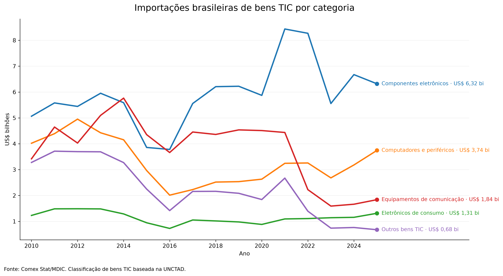
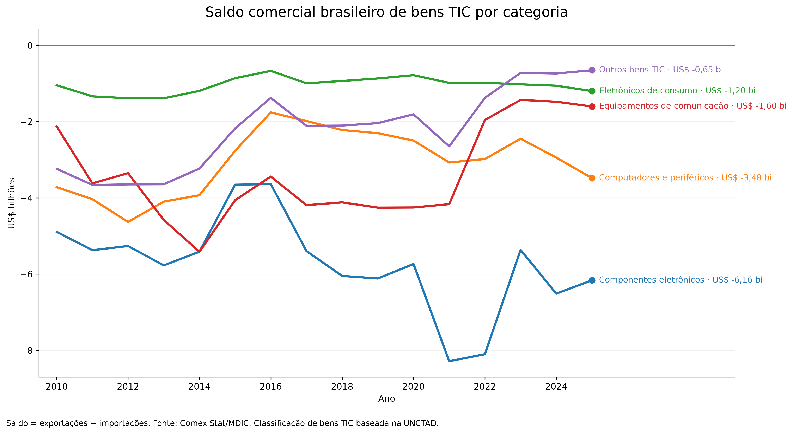
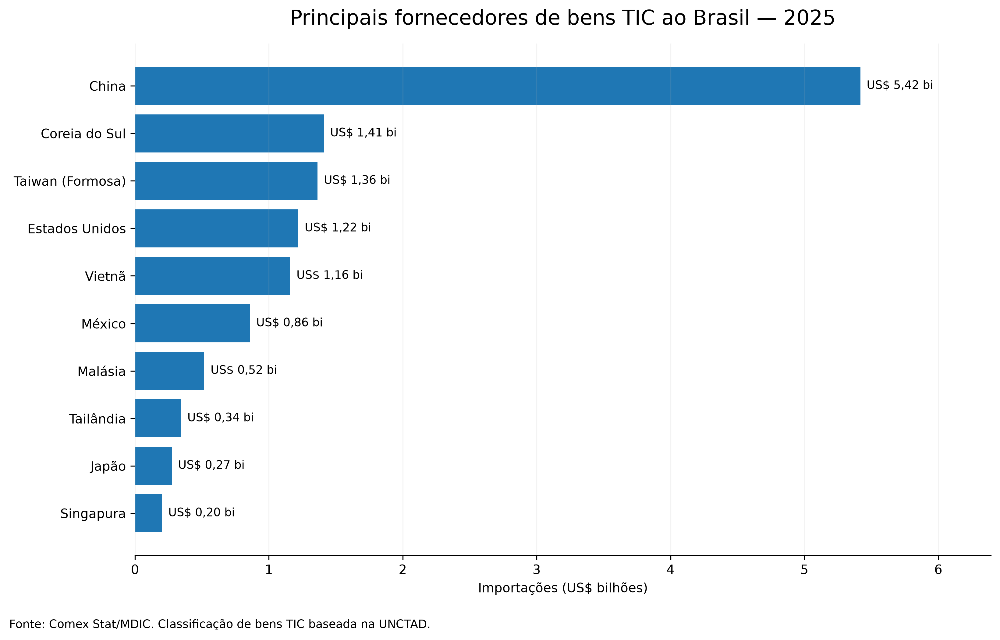
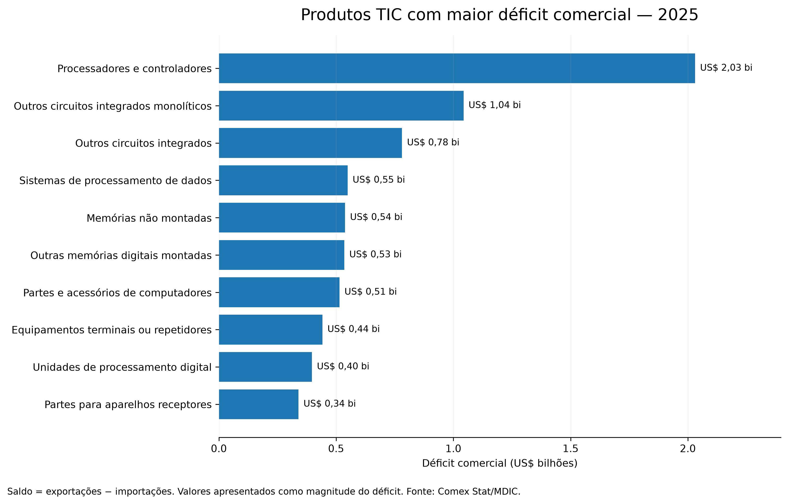

# Dependência tecnológica brasileira no comércio exterior

Análise das importações e exportações brasileiras de bens de Tecnologia da Informação e Comunicação (TIC) entre 2010 e 2025, com foco na composição tecnológica do comércio, saldo comercial, principais países fornecedores e produtos com maior déficit.

O projeto utiliza dados do Comex Stat/MDIC, classificação de bens TIC baseada na UNCTAD, DuckDB para armazenamento e análise, SQL para exploração dos dados e Python para visualização.

## Pergunta de análise

**Em quais tecnologias e países o Brasil apresenta maior dependência externa, e como essa estrutura mudou ao longo do tempo?**

A análise foi estruturada em quatro dimensões:

- evolução das importações de bens TIC;
- saldo comercial por categoria tecnológica;
- principais países fornecedores;
- produtos com maior déficit comercial.

## Período analisado

**2010–2025**

## Fonte dos dados

Os dados de comércio exterior foram obtidos a partir da base pública do **Comex Stat**, disponibilizada pelo Ministério do Desenvolvimento, Indústria, Comércio e Serviços (MDIC).

Foram utilizadas as bases anuais de:

- importações brasileiras;
- exportações brasileiras;
- classificação NCM;
- países.

Os produtos foram relacionados à classificação de bens TIC da **UNCTAD** por meio do código SH6.

## Categorias tecnológicas

Os bens TIC foram agrupados em cinco categorias:

| Código | Categoria |
|---|---|
| ICT01 | Computadores e periféricos |
| ICT02 | Equipamentos de comunicação |
| ICT03 | Eletrônicos de consumo |
| ICT04 | Componentes eletrônicos |
| ICT05 | Outros bens TIC |

A NCM brasileira possui oito dígitos e é baseada no Sistema Harmonizado. Os seis primeiros dígitos correspondem ao SH6, utilizado para relacionar os produtos brasileiros à classificação internacional de bens TIC.

## Tecnologias utilizadas

- **SQL** — consultas, agregações e análise dos dados;
- **DuckDB** — armazenamento e processamento local;
- **Python** — automação e visualização;
- **pandas** — manipulação dos resultados das consultas;
- **Matplotlib** — construção dos gráficos.

## Estrutura do projeto

    soberania-digital-brasil/
    ├── artigos/
    ├── dados/
    │   ├── brutos/
    │   └── tratados/
    ├── graficos/
    │   ├── 01_importacoes_por_categoria.png
    │   ├── 02_saldo_por_categoria.png
    │   ├── 03_principais_fornecedores.png
    │   └── 04_produtos_maior_deficit.png
    ├── python/
    │   ├── 02_criar_banco.py
    │   └── 03_graficos.py
    ├── sql/
    │   ├── 01_panorama_bens_ict.sql
    │   ├── 02_balanca_comercial_ict.sql
    │   ├── 03_paises_fornecedores.sql
    │   ├── 04_produtos_tecnologicos.sql
    │   └── 05_resumo_historico.sql
    └── README.md

## Metodologia

Os arquivos anuais do Comex Stat foram carregados em um banco DuckDB e organizados nas tabelas:

- `importacoes`;
- `exportacoes`;
- `ncm`;
- `paises`;
- `categorias_tecnologia`.

A identificação dos bens TIC segue a relação:

**Importações/Exportações → NCM → SH6 → Categoria tecnológica**

As tabelas de importações e exportações são relacionadas à tabela NCM pelo código `co_ncm`.

A tabela NCM fornece o código `co_sh6`, utilizado para relacionar cada produto à tabela `categorias_tecnologia`.

A partir dessa estrutura, as consultas SQL foram utilizadas para calcular importações, exportações e saldo comercial por ano, categoria, país e produto.

O saldo comercial foi definido como:

**saldo = exportações − importações**

Valores negativos representam déficit comercial.

---

## Resultados

### 1. Evolução das importações

**Interpretações para o gŕafico 1**
- As importações apresentam comportamentos distintos entre as categorias ao longo do período.

- Componentes eletrônicos registraram aproximadamente **US$ 5,06 bilhões** em importações em 2010 e **US$ 6,32 bilhões** em 2025.

- A categoria também apresentou forte crescimento no início da década de 2020, superando US$ 8 bilhões em 2021 e 2022.

- Computadores e periféricos apresentaram **US$ 4,02 bilhões** em importações em 2010 e **US$ 3,74 bilhões** em 2025.

- Equipamentos de comunicação, passaram de **US$ 3,42 bilhões** em 2010 para **US$ 1,84 bilhão** em 2025.

### 2. Saldo comercial

**Interpretações para o gŕafico 2**
- Todas as cinco categorias analisadas apresentaram **saldo comercial negativo em todos os anos entre 2010 e 2025**.

- Em 2025, componentes eletrônicos apresentaram o maior déficit entre as categorias analisadas: **US$ -6,16 bilhões**

No mesmo ano:

| Categoria | Importações | Exportações | Saldo |
|---|---:|---:|---:|
| Componentes eletrônicos | US$ 6,32 bi | US$ 0,16 bi | US$ -6,16 bi |
| Computadores e periféricos | US$ 3,74 bi | US$ 0,26 bi | US$ -3,48 bi |
| Equipamentos de comunicação | US$ 1,84 bi | US$ 0,24 bi | US$ -1,60 bi |
| Eletrônicos de consumo | US$ 1,31 bi | US$ 0,11 bi | US$ -1,20 bi |
| Outros bens TIC | US$ 0,68 bi | US$ 0,03 bi | US$ -0,65 bi |

No conjunto dos bens TIC analisados:

| Ano | Importações | Exportações | Saldo |
|---|---:|---:|---:|
| 2010 | US$ 17,01 bi | US$ 1,99 bi | US$ -15,02 bi |
| 2025 | US$ 13,89 bi | US$ 0,80 bi | US$ -13,10 bi |

### 3. Principais fornecedores

**Interpretações para o gŕafico 3**
 - Em 2025, a **China** foi o principal país de origem das importações brasileiras de bens TIC.

- Entre os principais fornecedores também aparecem:
    - Coreia do Sul;
    - Taiwan (Formosa);
    - Estados Unidos;
    - Vietnã;
    - México;
    - Malásia;
    - Tailândia;
    - Japão;
    - Singapura.

- Reflete a liderança da China na exportação de bens TIC a partir de 2010.

### 4. Produtos com maior déficit

**Interpretações para o gŕafico 3**
- Entre os produtos com maior déficit em 2025 aparecem:

    - processadores e controladores;
    - outros circuitos integrados monolíticos;
    - outros circuitos integrados;
    - sistemas de processamento de dados;
    - memórias não montadas;
    - outras memórias digitais montadas;
    - partes e acessórios de computadores;
    - equipamentos terminais ou repetidores;
    - unidades de processamento digital;
    - partes para aparelhos receptores.

- O maior déficit individual identificado foi o de **processadores e controladores**, com aproximadamente **US$ 2,03 bilhões** em 2025.

- Os três maiores déficits individuais relacionados a circuitos integrados somaram aproximadamente **US$ 3,85 bilhões** no ano.

---

## Comparação histórica

A comparação entre 2010 e 2025 mostra diferenças importantes entre as categorias:

| Categoria | Importações 2010 | Importações 2025 | Saldo 2010 | Saldo 2025 |
|---|---:|---:|---:|---:|
| Componentes eletrônicos | US$ 5,06 bi | US$ 6,32 bi | US$ -4,89 bi | US$ -6,16 bi |
| Computadores e periféricos | US$ 4,02 bi | US$ 3,74 bi | US$ -3,72 bi | US$ -3,48 bi |
| Equipamentos de comunicação | US$ 3,42 bi | US$ 1,84 bi | US$ -2,13 bi | US$ -1,60 bi |
| Eletrônicos de consumo | US$ 1,23 bi | US$ 1,31 bi | US$ -1,04 bi | US$ -1,20 bi |
| Outros bens TIC | US$ 3,28 bi | US$ 0,68 bi | US$ -3,24 bi | US$ -0,65 bi |

**Obs:** A série completa deve ser considerada para analisar a trajetória de cada categoria, já que os valores apresentam oscilações entre os dois extremos do período.

## Organização das análises SQL

As consultas foram separadas de acordo com a pergunta respondida por cada etapa.

#### `01_panorama_bens_ict.sql`

Analisa a evolução das importações por categoria tecnológica e realiza verificações sobre os códigos SH6 classificados como bens TIC.

#### `02_balanca_comercial_ict.sql`

Compara importações e exportações e calcula o saldo comercial por categoria e por ano.

#### `03_paises_fornecedores.sql`

Identifica os principais países fornecedores de bens TIC ao Brasil e permite analisar a origem das importações por categoria.

#### `04_produtos_tecnologicos.sql`

Identifica os produtos NCM com maiores valores importados e os maiores déficits comerciais.

#### `05_resumo_historico.sql`

Resume a evolução histórica e compara os resultados de 2010 e 2025.

## Scripts Python

#### `02_criar_banco.py`

Responsável por:

- carregar os arquivos anuais de importação e exportação;
- carregar as tabelas auxiliares de NCM e países;
- criar o banco DuckDB;
- definir os tipos das colunas;
- criar a classificação tecnológica;
- executar verificações básicas dos dados.

#### `03_graficos.py`

Consulta diretamente o banco DuckDB e utiliza pandas e Matplotlib para gerar os quatro gráficos apresentados neste README.

O fluxo utilizado é:

**DuckDB → SQL → pandas → Matplotlib → PNG**

## Objetivo do projeto

Este projeto foi desenvolvido como uma análise de dados aplicada ao comércio exterior e à economia da tecnologia.

O objetivo técnico foi construir um fluxo de análise utilizando:

**dados públicos → DuckDB → SQL → Python → visualização**

A análise fornece uma base quantitativa para investigar a posição brasileira no comércio internacional de bens TIC, mantendo separadas a produção dos indicadores e a interpretação mais ampla de seus significados econômicos e políticos.